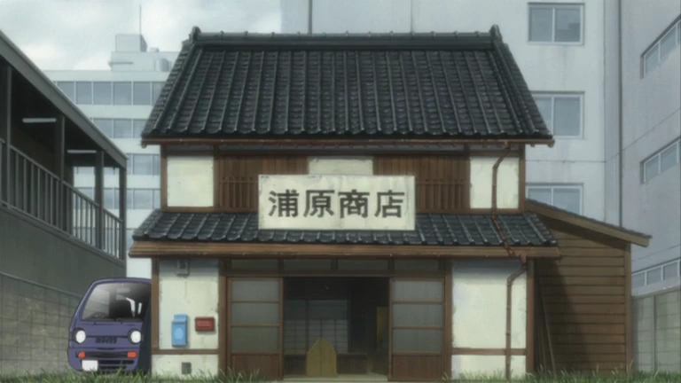
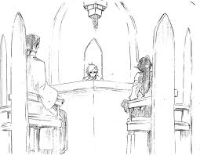
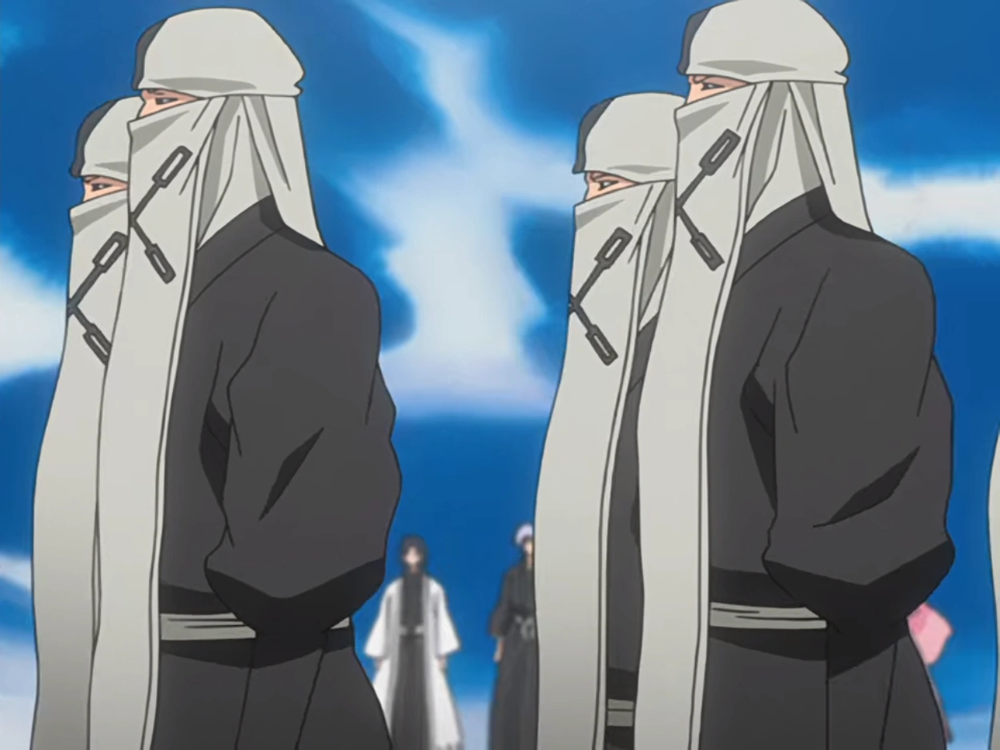
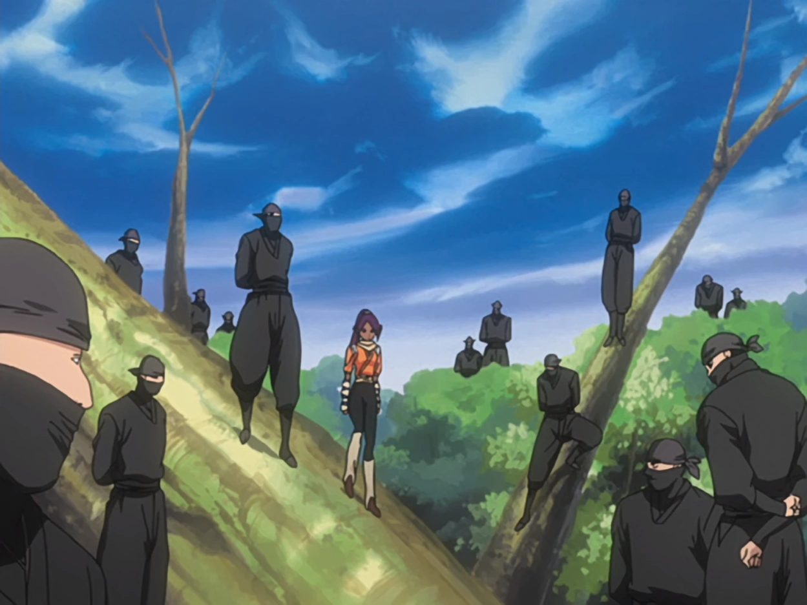
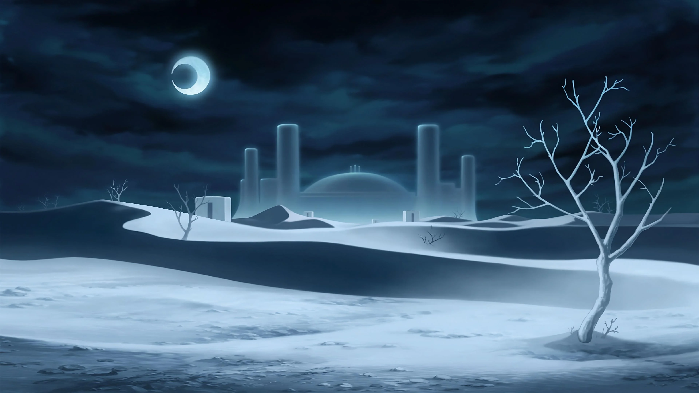
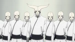

## Organisation du monde

### Le Monde des Humain :

Le Monde des Humains, également appelé Monde des Vivants, Monde Matériel ou Monde Réel, est le plan matériel où résident les humains vivants.

Le Monde des Humains abrite les Pluses, les Quincy, les Visored, le groupe de Kisuke Urahara et les Bounts. Les Hollows, qui résident normalement dans le Hueco Mundo, visitent souvent le Monde des Humains pour chasser les âmes dont ils se nourrissent.

Les zones les plus importantes du Monde des Humains incluent la Ville de Karakura, située dans l’ouest de Tokyo, où vivent Ichigo Kurosaki, sa famille et ses amis, ainsi que la Ville de Kagamino, qui se trouve à 22 km à l’est de Karakura, et la Ville de Naruki.

Xcution a son quartier général dans le district de Chōbara de la Ville de Naruki, qui se trouve approximativement à l’ouest de Karakura.

#### Le Groupe de Kisuke Urahara

Kisuke Urahara est un ancien capitaine de la Soul Society qui a été exilé. Après son départ, il s’installe dans le Monde des Humains, où il ouvre une boutique qui sert de couverture pour ses activités liées aux esprits. Urahara et ses alliés, tels que Yoruichi Shihouin, un ancien capitaine de la Soul Society, et Tessai Tsukabishi, l'un de ses compagnons de longue date, ont un rôle clé dans la protection des Pluses et dans les événements qui concernent les Hollows et les autres menaces surnaturelles.

#### Xcution

Xcution, le groupe fondé par les Fullbringers, est principalement axé sur la récupération des pouvoirs des Fullbringers. Le groupe a l’intention de créer des Fullbringers plus puissants, mais leur méthode de récupération et de manipulation de l’énergie spirituelle semble parfois mystérieuse et ambiguë.

Ils cherchent également à exploiter les capacités des Fullbringers pour leurs propres intérêts, en se rassemblant pour créer un programme de développement des Fullbringers, leur permettant d'atteindre des niveaux de puissance plus élevés.

#### Le Groupe d'Ichigo Kurosaki

Le groupe d'Ichigo Kurosaki est constitué de ses proches, amis et alliés qui l'aident à affronter diverses menaces dans le Monde des Humains et au-delà. Ensemble, ils jouent un rôle central dans la lutte contre les Hollows, les Arrancars, et d'autres ennemis puissants.

---

### Soul Society

Soul Society est l'au-delà (également appelé le monde spirituel). C'est également l'endroit où vivent les Shinigami et où la plupart des âmes résident jusqu'à leur réincarnation dans le Monde des Humains. Aux côtés du Monde des Vivants et du Hueco Mundo, Soul Society est l'un des Trois Mondes.

#### Juridiction

Le Central 46 sert la royauté des Shinigami. Il est composé de 40 sages et 6 juges, choisis parmi toute la Soul Society. Ils sont scellés dans une enclave de Seireitei appelée Seijōtōkyorin à laquelle personne d’autre ne peut accéder, quel que soit leur statut militaire ou civil. Ils agissent comme une organisation judiciaire suprême, dont l'autorité la place directement en contrôle du système juridique. Ils traitent de toutes les décisions concernant les Shinigami et les âmes ayant violé des interdictions. Leurs ordres sont absolus et aucune décision n'a été connue pour être renversée.

#### Noblesse

Une autre partie du gouvernement est constituée des Maisons Nobles, en particulier les Quatre Grandes Familles Nobles, qui sont considérées comme les plus élevées de toutes. Les maisons nobles inférieures servent chacune l'une des quatre grandes familles.

#### Gotei 13

Le Gotei 13 est l'organisation à laquelle la plupart des Shinigami adhèrent après avoir gradué de l'Académie Shin'ō. Elle est divisée en treize divisions, certaines divisions ayant des spécialisations particulières. La 4e Division est la division médicale, la 11e Division est la division de combat, et la 12e Division est la division de recherche/sciences. La 9e Division est en charge des tâches liées aux journaux et magazines. Il n'est pas clair si les autres divisions ont des spécialisations, car seules les quatre mentionnées reçoivent une attention significative, à l'exception de leurs membres.

#### Garde Royale

Également connue sous le nom de Division Zéro, la Garde Royale est composée d'anciens capitaines du Gotei 13 qui sont responsables de la protection du Roi de l'Âme. Chaque membre de ce groupe a été reconnu par le Roi de l'Âme pour ses contributions significatives au développement de la Soul Society et a été promu à la Garde Royale pour ses réalisations respectives. Étant donné que leur objectif principal est de servir et de protéger le Roi de l'Âme, la Garde Royale n'interfère pas dans les affaires du Gotei 13 et ne joue pas un rôle actif dans la défense de la Soul Society contre les menaces extérieures. Ils obéissent uniquement au Roi de l'Âme et à la Famille Royale ; le Central 46 n’a aucun contrôle sur eux.

#### Corps Kidō

Il y a actuellement peu d'informations sur le Corps Kidō en raison du secret dans lequel ils opèrent. Les membres du Corps excelleront dans le Kidō.

#### Onmitsukidō

Il y a peu d'informations sur les opérations de l'Onmitsukidō. Ils sont actuellement dirigés par Suì-Fēng, qui est également le capitaine de la 2e Division du Gotei 13. Elle a succédé à Yoruichi Shihōin dans les deux rôles.

---

### Hueco Mundo

Hueco Mundo est un monde alternatif où résident généralement les Hollows et les Arrancars. Il se situe entre le Monde des Humains et la Soul Society, étant l'un des trois plans d'existence collectivement appelés les Trois Mondes.

#### Espada

Dix des Arrancars les plus puissants. Classés de 0 à 9 en fonction de leur capacité au combat. Leurs rangs sont tatoués sur leurs corps.

#### Fracción

Arrancars qui servent sous les Espada. Les Espada ont la possibilité d'avoir autant de Fracción qu'ils le souhaitent.

#### Privaron Espada

Arrancars dépouillés de leur rang d'Espada et attribués un rang Tres Cifras.

#### Exequias

Une unité responsable de l'élimination des intrus dans Las Noches.

