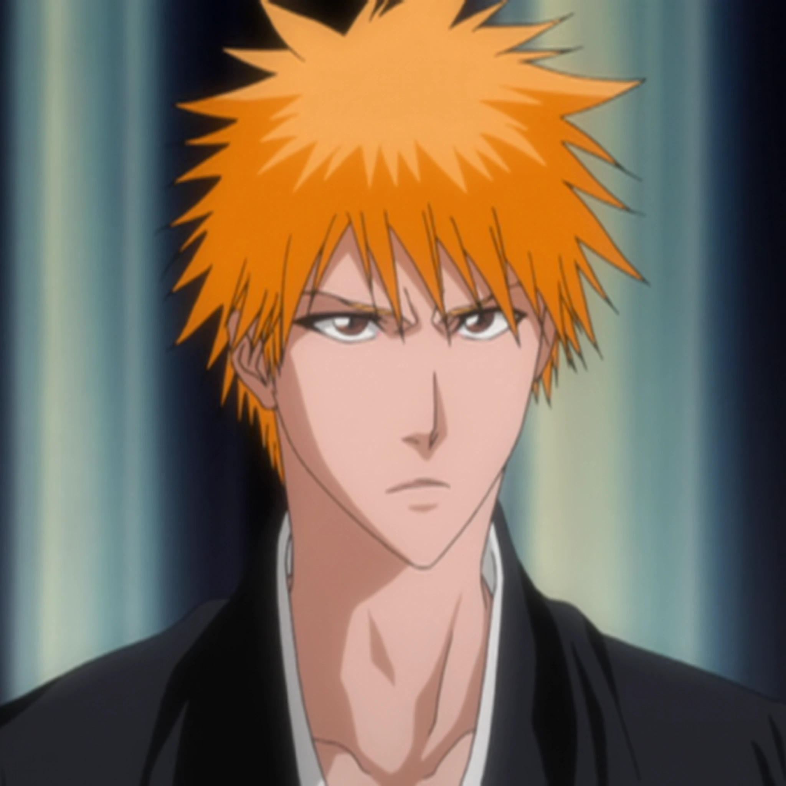
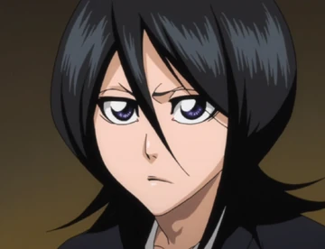
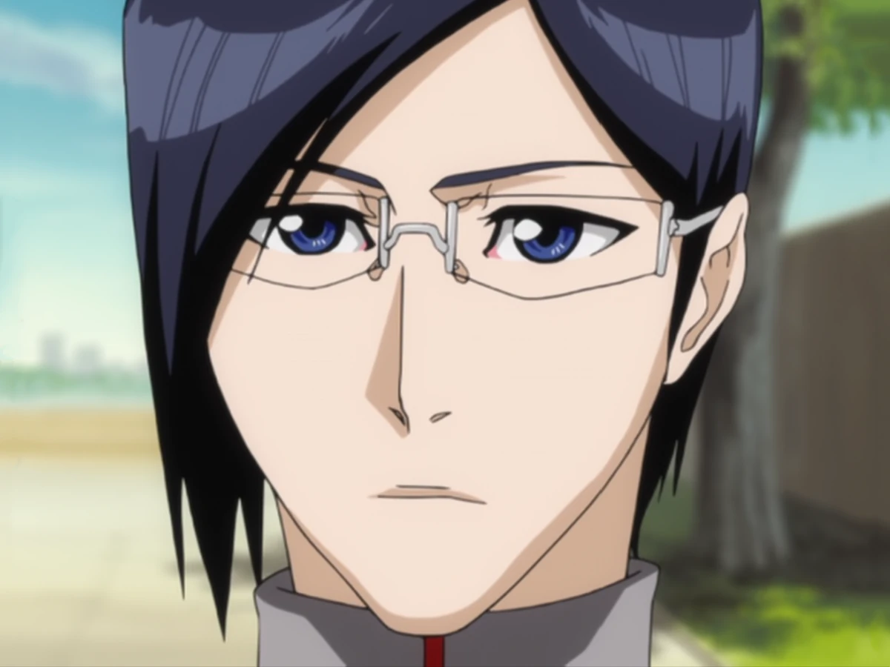
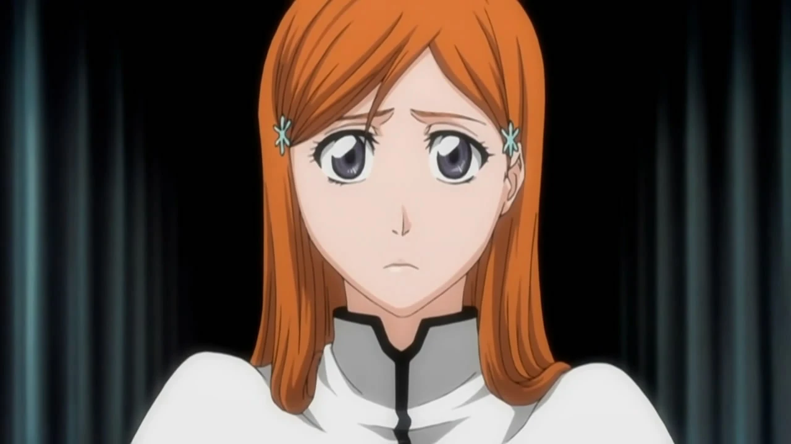
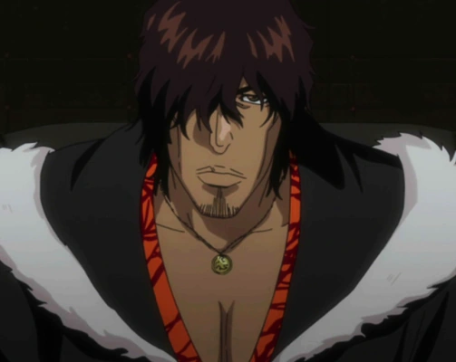

## Liste des personnages

### Ichigo Kurosaki

Âge : 15 ans au début de la série 

Ichigo est un lycéen capable de voir les esprits depuis son plus jeune âge. Il a une forte personnalité, un sens aigu de la justice, et se bat toujours pour protéger ceux qu’il aime. Malgré son apparence dure, il est profondément empathique.

Affiliations :

- Clinique de Kurosaki
- Groupe d'Ichigo
- Ville de Karakura
- Loosely Soul Society

Affiliation (anciennement) :

- Visored Non-officiellement
- Xcution

Occupation (anciennement) :

- Lycéen
- Garçon de courses de la boutique Unagiya

Parents / Famille :

- Orihime Inoue (épouse)
- Kazui Kurosaki (fils)
- Isshin Kurosaki (père)
- Masaki Kurosaki (mère) †
- Karin Kurosaki (sœur cadette)
- Yuzu Kurosaki (sœur cadette)
- Kūkaku Shiba (cousine paternelle)
- Ganju Shiba (cousin paternel)
- Uryū Ishida (cousin issu de germains du côté maternel)
- Ryūken Ishida (petit-cousin maternel une génération au-dessus / cousin germain une fois éloigné du côté maternel)

### Rukia Kuchiki 

Rukia Kuchiki est une Shinigami talentueuse appartenant à une noble famille du Seireitei. Proche d’Ichigo Kurosaki, elle joue un rôle central dans de nombreux événements majeurs. Elle est également liée à plusieurs figures importantes du Gotei 13, aussi bien sur le plan personnel que professionnel.

Âge : Environ +150 ans

Affectiation :

- Gotei 13
- Soul Society
- Groupe d'Ichigo

Profession :

- Shinigami 

Position :

- Capitaine de la 13e Division

Position Précédente :

- Lieutenant de la 13e Division

Parents / Famille :

- Renji Abarai (époux)
- Ichika Abarai (fille)
- Hisana Kuchiki (sœur aînée) †
- Byakuya Kuchiki (frère adoptif / beau-frère)
- Ginrei Kuchiki (grand-père adoptif)

### Uryu Ishida

Uryū Ishida est un Quincy vivant à Karakura Town. Il travaille comme médecin à l'hôpital de Karakura et est à la fois un proche parent et un ami d'Ichigo Kurosaki. Au fil de son parcours, il joue un rôle important dans divers événements, naviguant à travers ses liens complexes avec son héritage et les défis qui se présentent à lui.

Âge : 15 ans au début de la série 

Affiliation :

- Hôpital de Karakura, Ville de Karakura

Affiliation Précédente :

- Wandenreich

Occupation :

- Médecin

Occupation Précédente :

- Successeur de Yhwach
- Schutzstaffel
- Élève de lycée
- Président du Conseil des Étudiants de K.H. (25e promotion)

Équipe :

- Le groupe d'Ichigo
- Sternritter (anciennement)
- Schutzstaffel (anciennement)

Parents / Famille :

- Ryūken Ishida (père)
- Kanae Ishida (mère) †
- Sōken Ishida (grand-père) †
- Izumi Ishida (grand-mère) †
- Ichigo Kurosaki (cousin issu de germains)
- Yuzu Kurosaki (cousine issue de germains)
- Karin Kurosaki (cousine issue de germains)

### Orihime Inoue

Orihime Inoue est une humaine vivant à Karakura Town. Ancienne élève du lycée de Karakura, elle joue un rôle important parmi ses amis et dans les événements qui se déroulent autour de Karakura.

Âge : 15 ans au début de la série 

Affiliation :

- Clinique Kurosaki
- Ville de Karakura

Occupation :

- Employé de boulangerie (à temps partiel)

Équipe :

- Le groupe d'Ichigo

Parents / Famille :

- Ichigo Kurosaki (époux)
- Kazui Kurosaki (fils)
- Sora Inoue (frère aîné) †
- Père sans nom †
- Mère sans nom †
- Grand-père sans nom †
- Tante sans nom †
- Isshin Kurosaki (beau-père)
- Karin Kurosaki (belle-sœur)
- Yuzu Kurosaki (belle-sœur)

### Yasutora Sado

Yasutora Sado, surnommé Chad, est un humain résidant à Karakura Town. Ancien camarade de classe d’Ichigo Kurosaki au lycée de Karakura, il est connu pour sa force impressionnante et poursuit une carrière dans le domaine sportif.

Âge : 16 ans au début de la série 

Affiliation :

- Ville de Karakura, Groupe d’Ichigo

Affiliation Précédente :

- Xcution

Occupation :

- Lycéen
- Boxeur professionnel

Équipe :

- Le groupe d’Ichigo

Parents / Famille :

- Oscar Joaquín de la Rosa (grand-père, décédé)
- Mère sans nom (décédée)
- Père sans nom (décédé)

### Renji Abarai

Renji Abarai est un Shinigami occupant un poste important au sein de la 6e division du Gotei 13, sous les ordres du capitaine Byakuya Kuchiki. Connu pour son tempérament énergique et sa loyauté, il a gravi les échelons après avoir servi dans d'autres divisions. Il entretient également des liens étroits avec plusieurs personnages majeurs.

Âge : Environ +150 ans

Affiliation :

- Gotei 13, Soul Society
- Groupe d’Ichigo

Profession :

- Shinigami (Dieu de la mort)

Poste :

- Lieutenant de la 6e Division

Poste Précédent :

- 6e Siège de la 11e Division

Parents / Famille :

- Rukia Kuchiki (épouse)
- Ichika Abarai (fille)
- Byakuya Kuchiki (beau-frère)