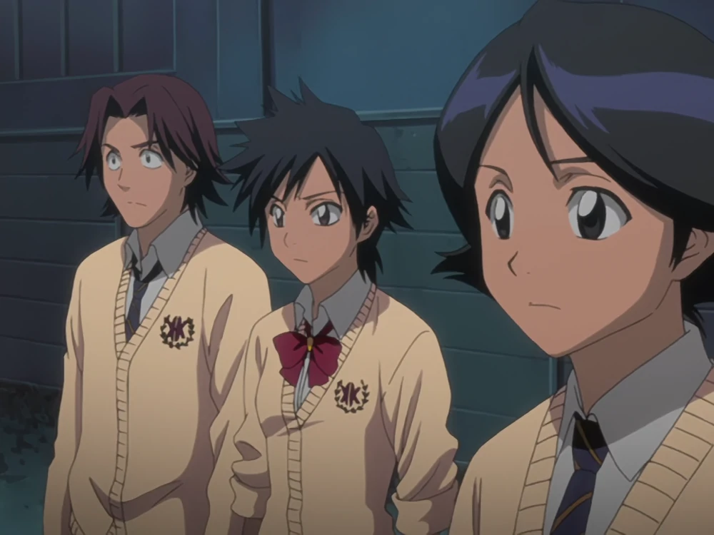
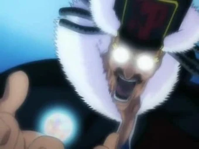
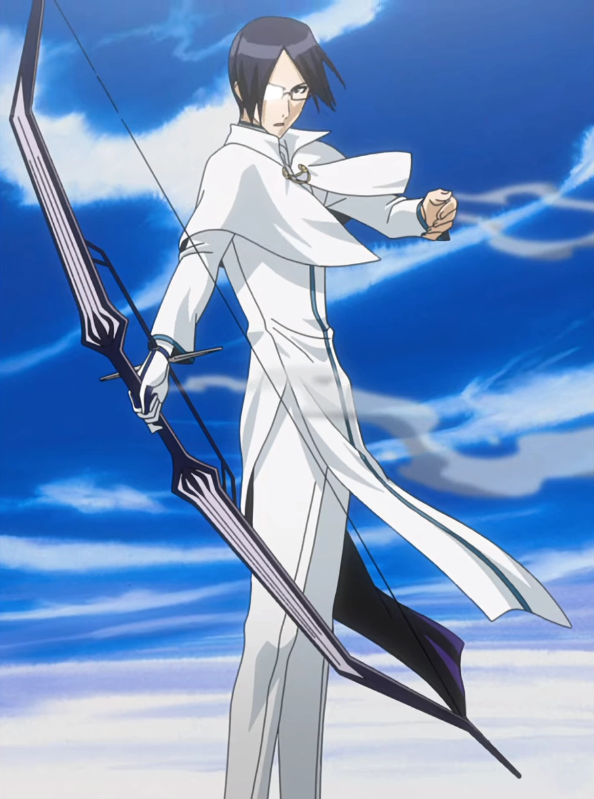
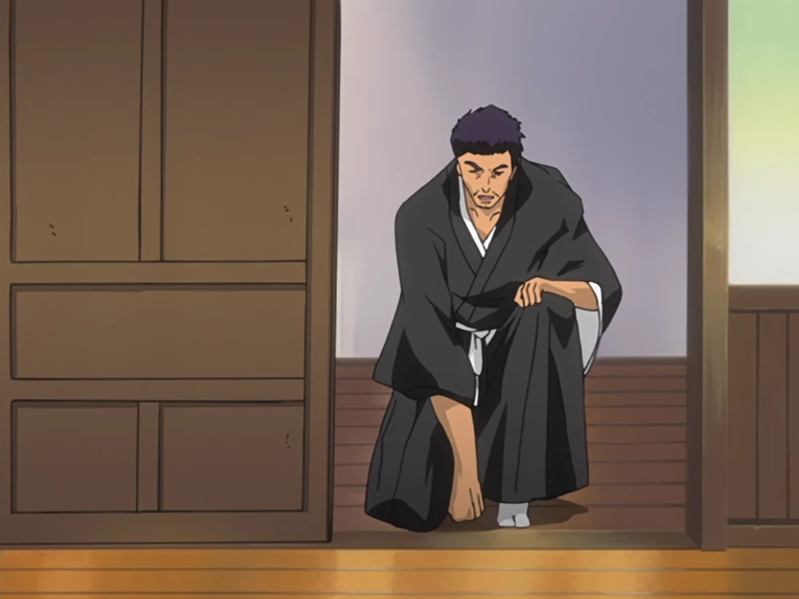
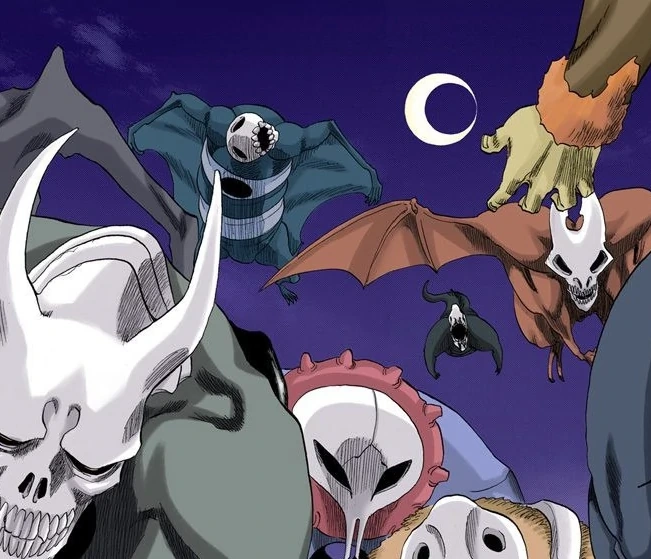

## Les races

### Les humains

Un Humain est un être vivant qui réside dans le Monde des Humains. La plupart des êtres qui vivent dans le Monde des Humains sont des Humains. Le corps d'un Humain, comme tout ce qui existe dans le Monde des Humains, est constitué de Kishi et contient une âme, liée à lui par la Chaîne du Destin. Les Humains sont l'opposé des Hollows.

### Les Humains à haut potentiel

Un très petit pourcentage de la population humaine développe une grande quantité de Reiryoku ; ils sont connus sous le nom d'Humains à haut potentiel. Ces Humains peuvent voir et interagir avec des objets faits de Reishi, tels que les âmes, à divers degrés et pour différentes raisons.

Dans des cas encore plus rares, les Humains à haut potentiel développeront des pouvoirs, soit spontanément, soit à la suite d'une intervention, ce qui leur permettra non seulement d'interagir avec les âmes, mais aussi de se défendre ainsi que d'autres contre les dangers posés par les Hollows et autres esprits parasitaires.

### Les Quincy

Les Quincy sont une race d'Humains vivants dotés d’une conscience spirituelle. Ils se distinguent par leur capacité à manipuler le Reishi et à détruire complètement l'existence des Hollows, étant considérés comme l'exact opposé des Shinigami.
La plupart des Quincy ont été exterminés par la Soul Society il y a plus de 200 ans afin de prévenir l'effondrement des mondes, causé par l’élimination massive des Hollows.

#### Pouvoirs

##### Hirenkyaku :
Une technique de mouvement avancée des Quincy permettant à l'utilisateur de se déplacer à grande vitesse en surfant sur le flux de Reishi créé sous ses pieds. C'est l'équivalent Quincy du Shunpo des Shinigami et du Sonído des Arrancars.

##### Blut :
En faisant circuler le Reishi directement dans leurs vaisseaux sanguins, les utilisateurs de cette technique peuvent augmenter leur puissance d'attaque et de défense à des niveaux inhumains. Cependant, malgré le danger significatif que cela représente pour leurs adversaires, Blut a un défaut majeur : les formes indépendantes de la technique pour l'attaque et la défense utilisent deux systèmes de Reishi différents et ne peuvent pas être utilisées simultanément. L'acquisition de Blut dépend du sang des Quincy.

##### Ransōtengai :
Une technique de haut niveau qui permet à l'utilisateur de contrôler ses membres à l'aide de fils de Reiryoku contrôlés par son cerveau, formant des lignes ou des fils à partir de Reishi. Grâce à cette technique, l'utilisateur peut contrôler son corps comme une marionnette, ce qui lui permet de bouger librement malgré une paralysie, des membres cassés ou toute autre force qui entraverait un mouvement normal. Elle a été initialement créée pour permettre aux Quincy âgés de se battre efficacement, et elle est suffisamment rare pour que Mayuri n'ait jamais rencontré un Quincy capable de l'utiliser avant Uryū. Mayuri l'a qualifiée de "technique la plus puissante pour les Quincy", mais il ne connaissait pas le Quincy : Letzt Stil, ce qui signifie qu'en l'état, il pensait que c'était la plus forte.

##### Quincy : Letzt Stil :
Le dernier recours pour un Quincy, atteint après avoir retiré le Gant Sanrei. Il confère à l'utilisateur une quantité énorme de puissance, mais au prix de la perte de ses pouvoirs une fois la forme terminée. 

##### Quincy : Vollständig :
Une partie de l'évolution des Quincy et la réponse aux inconvénients du Quincy : Letzt Stil. Il s'agit de la capacité la plus facile à comprendre, car l'apparence et la puissance du pratiquant changent de manière drastique.

##### Sklaverei :
La capacité de Quincy la plus basique au niveau le plus élevé. Elle permet à un Quincy utilisant le Quincy : Vollständig de déchirer le Reishi dans l'environnement pour augmenter ses propres pouvoirs. Elle peut potentiellement être utilisée pour absorber des êtres spirituels.

##### Kirchenlied: Sankt Zwinger :
Un puissant sort de Quincy qui crée une zone de Reishi façonnée avec d'innombrables croix Quincy sortant du sol : Bien que ses effets restent invisibles, Royd Lloyd l'a décrit comme "le sort de protection maximale parmi les techniques d'attaque et de défense des Quincy" et a déclaré que "la lumière du seigneur" frappera et tuera tout ce qui entre dans ses limites.

##### Qual Kreis :
Un sort de Quincy qui invoque une série de colonnes de Reishi autour de la cible, qui se transforment en grands Heilig Bogen et tirent de grands Heilig Pfeil sur la cible depuis tous les côtés.

##### Schrift :
Une lettre accordée par Yhwach qui réveille des capacités uniques

### Les Fullbringer

Le Fullbring est une capacité qui apparaît chez les Humains dont les mères ont été attaquées par des Hollows à un moment donné. L’attaque a laissé des traces dans le corps des mères, qui ont ensuite été absorbées par les enfants alors qu’ils étaient encore dans l’utérus.
Cette capacité permet à son utilisateur de puiser dans les âmes contenues dans les objets pour les manipuler selon sa volonté.

### Les Shinigami

Les Shinigami sont des âmes chargées de réguler l’équilibre des âmes entre le Monde des Humains et la Soul Society. Ils envoient les Pluses vers la Soul Society grâce au Konsō, et sont également responsables de combattre et purifier les Hollows à l’aide de leur Zanpakutō. Certaines âmes possèdent un pouvoir spirituel leur permettant d’entrer à l’Académie Shin’ō pour devenir Shinigami.

#### Pouvoirs

##### Zanjutsu :
L'art du combat à l'épée, également appelé la technique du Zanpakutō, est l'un des quatre styles de combat de base des Shinigami. Il est honteux pour un Shinigami de ne pas maîtriser au moins cette technique. C'est la spécialité du Capitaine Kenpachi Zaraki de la 11e Division.

##### Hohō :
Méthode de déplacement, est un style de combat défensif lié à l'agilité des déplacements. C'est l'une des quatre compétences de combat de base des Shinigami.

##### Shunpo :
Technique de déplacement qui permet à l'utilisateur de se déplacer plus vite que l'œil ne peut suivre. La vitesse étant l'élément principal de la technique, elle se caractérise par la rapidité avec laquelle on peut passer d'un point A à un point B en utilisant le moins d'étapes possibles. L'entraînement et la maîtrise déterminent la vitesse de déplacement de l'utilisateur. Ceux qui ont peu d'expérience dans cette technique ou qui ne l'ont pas pratiquée depuis un certain temps seront plus lents, devant utiliser plus de pas pour parcourir la même distance et se fatiguer plus rapidement.

##### Kidō : 
L'une des quatre principales techniques de combat dans le Zankensoki, le groupe des compétences principales des Shinigami, qui utilise divers sorts. Ces sorts sont créés avec un Reiryoku puissant et se divisent en deux catégories : Hadō pour les attaques directes et Bakudō pour le soutien au combat. Les sorts Kidō sont généralement déclenchés par une incantation. Les utilisateurs expérimentés peuvent les utiliser sans cette incantation, bien que l'efficacité du sort puisse être réduite.

##### Bakudō : 
Une large catégorie de sorts défensifs, de communication, de liaison, de suivi et de scellement. Ces sorts sont utilisés principalement pour restreindre ou immobiliser l'ennemi, protéger les alliés ou assurer un contrôle sur diverses situations grâce à la manipulation du Reiryoku.

##### Hakuda : 
Un style de combat rapproché dans lequel l'utilisateur est désarmé et utilise uniquement son corps. C'est l'une des quatre compétences de combat de base des Shinigami.

### Les Hollows

Les Hollows sont une race de créatures spirituelles masquées, nées d'âmes humaines qui, pour diverses raisons, ne passent pas dans la Soul Society après leur mort et restent trop longtemps dans le Monde des Humains.

Ce sont des esprits corrompus dotés de pouvoirs surnaturels, qui dévorent les âmes des humains vivants comme des morts. Les Hollows s’installent dans Hueco Mundo, mais peuvent traverser vers le Monde des Humains ou la Soul Society.
Les Hollows sont l’opposé des Humains.

#### Pouvoirs

##### Séparation âme-corps :
Deux Hollows de classe moyenne, Shrieker et Acidwire, ont utilisé cette capacité. Elle permet à un Hollow d'extraire de force l'esprit vivant de son corps. Elle est rarement utilisée, car les Hollows s'en prennent généralement aux Pluses, qui n'ont pas de corps physique ou vivant. Acidwire l'a utilisée sur sa jeune sœur, Orihime Inoue, afin qu’elle puisse le voir et lui parler. Shrieker l’a utilisée à des fins plus sinistres, piégeant le jeune garçon Yūichi Shibata dans le corps d’une perruche pendant trois mois pendant que le Hollow le pourchassait. L’âme reste attachée par la Chaîne du Destin et peut être sauvée, mais si elle est rompue (comme dans le cas de Yūichi), l’âme peut éviter la corruption tant qu’elle est placée dans un corps ou un animal dépourvu d’âme.

##### Toucher acide :
De nombreux Hollows, comme Shrieker et Acidwire, ont démontré cette capacité, bien que Rukia Kuchiki suggère que tous les Hollows la possèdent. Lorsqu’un Hollow saisit un humain avec ses mains, l’endroit touché est brûlé comme si de l’acide y avait été versé. Cela s’est produit quand Orihime a été saisie par la jambe, et quand le dos de Chad a été blessé. Ces blessures sont très douloureuses, mais peuvent guérir avec le temps. On ignore si cette capacité fonctionne sur les Shinigami ou d’autres êtres spirituellement puissants.

##### Cero :
C’est une décharge sphérique d’énergie spirituelle utilisée par les Menos Grande, les Arrancars et les Shinigami ayant acquis des pouvoirs de Hollow. Sa puissance et son temps de charge varient selon l’utilisateur, et bien qu’il soit généralement rouge, il peut aussi être d’autres couleurs. Plusieurs Arrancars et Shinigami Hollowfiés ont développé des variantes uniques du Cero.

##### Garganta :
C’est le vide qui existe entre les Trois Mondes, que les Hollows et les Arrancars peuvent utiliser pour se déplacer vers et depuis Hueco Mundo. Kaname Tōsen, Kisuke Urahara et Mayuri Kurotsuchi ont également démontré la capacité de l’utiliser pour se téléporter. Il déchire le tissu dimensionnel séparant les Trois Mondes, révélant un tunnel de Reishi tourbillonnant et torrentiel qu’il faut concentrer et solidifier pour créer un chemin clair.

##### Kūmon :
C’est une capacité des Hollows qui leur permet de déchirer les barrières entre les Trois Mondes, créant ainsi une distorsion spatiale qui ouvre un passage vers les autres royaumes. Les Gillians utilisent généralement cette méthode pour se rendre dans le Monde des Humains.

##### Negación :
Ce sont des champs utilisés pour secourir d’autres Hollows. Seuls les Menos de classe Gillian ont été vus les utiliser. Les Espada possèdent un dispositif spécial en forme de cube appelé Caja Negación, conçu pour simuler les champs de Negación, et utilisé pour piéger et punir leurs subordonnés si nécessaire.

### Les Visored

Les Visored sont un groupe de Shinigami ayant acquis des pouvoirs de Hollow.

### Les Arrancars

Un Arrancar est un Hollow qui a retiré son masque et acquis des pouvoirs semblables à ceux d’un Shinigami.

#### Pouvoirs

##### Sonído : 
une technique de déplacement à grande vitesse équivalente au Shunpo des Shinigami et au Hirenkyaku des Quincy, ces techniques étant approximativement égales en termes de rapidité.

##### Régénération ultra-rapide ;
Une capacité qui permet à un Hollow de guérir la plupart de ses blessures très rapidement, à l’exception de la destruction de la tête ou des organes vitaux. Ulquiorra Cifer précise que la plupart des Arrancars abandonnent cette capacité en échange d’une puissance bien supérieure.